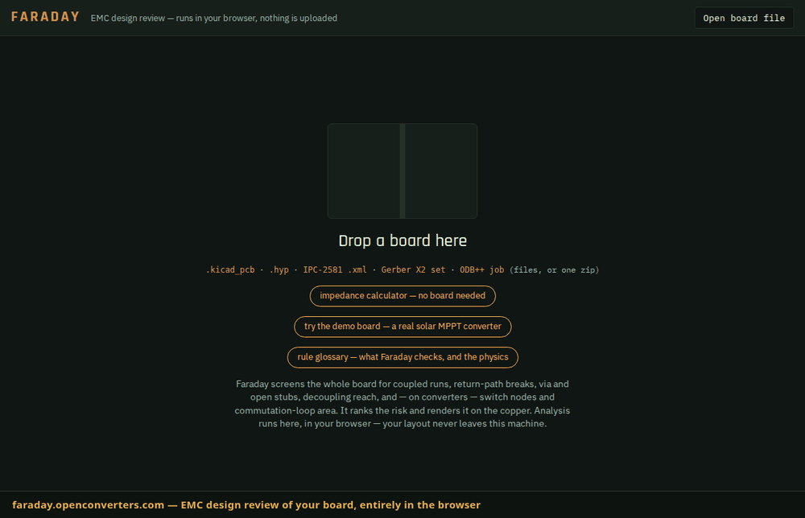

# Faraday

**Automated EMC design review for PCB layouts — in your browser, your board never leaves your machine.**

Faraday loads a PCB layout, screens the whole board with computational geometry + closed-form
transmission-line physics, and returns a **ranked list of crosstalk and EMC risk findings** —
each with the mechanism, the number, a stated confidence tier, and a remediation hint.



## Guided and advanced

One switch in the header, and it is the same review either way — same engine, same
findings, same ranking. **Guided** says each finding in the language of the person who
drew the board (*"this track crosses a gap in the copper underneath it, so its return
current has to detour"* · *"route around the gap, close it, or bridge it with a
capacitor"*), replaces the emissions sliders with four converter presets whose
assumptions are printed rather than hidden, and answers in words. **Advanced** is
everything: decibels, frequencies, confidence tiers, the physics text and the sliders
that drive it. Nothing is suppressed in guided and nothing is softened — the vocabulary
is the only difference, and every number is one click away (panels carry the switch too,
since the header sits behind them). A first visit lands in guided; the choice is
remembered.

## Formats

| Format | Reaches | Notes |
|---|---|---|
| **KiCad** `.kicad_pcb` | KiCad 5–9 | legacy layer names, `(module)`, zone-inherited fills |
| **HyperLynx** `.hyp` | Altium, PADS, Expedition, Eagle | carries its own stackup with permittivity |
| **IPC-2581** `.xml` | rev B/C exporters | no other open-source reader exists |
| **ODB++** job | Altium, Cadence, Mentor, KiCad 9 | exact nets, refdes and values; a directory or one zip |
| **Gerber X2** set | anything that fabs | net attributes where present; all files or one zip |
| **Gerber + IPC-D-356** | Altium fab outputs, TI EVM/TIDA zips | classic RS-274X named by Protel extensions; the .ipc netlist supplies exact nets, refdes and pins, propagated through the copper |

Format is detected from the file's **contents**, not its name. Native CAD
databases are not read — an Altium `.PcbDoc` is a binary OLE file; export
ODB++ (or Gerber X2) from it and drop that. Neither carries a dielectric, so
Faraday reads the layer count off the board and asks only what it is built on.

## Rules

`coupled-run` (edge, broadside, and to copper-pour boundaries) · `diff-pair` (intentional
coupling, never a defect) · `3w` · `plane-crossing` and `sparse-reference` (return-path breaks,
rolled up when systemic) · `via-stub` and `dangling-stub` (λ/4 resonators) ·
`decoupling-distance` · and for power converters, `switch-node` and **`commutation-loop`** —
the input-cap → switch-pair → return loop whose enclosed area dominates converter emissions.
Six rules implement Franz (*EMV: Störungssicherer Aufbau elektronischer Schaltungen*, 5th ed.):
`connector-ground-spread` (scattered cable-ground entries drive the cables as antennas, §7.2),
`plane-cavity-mode` (VCC/GND cavity resonances from Gl. 5.3, corner vs. centre excitation, §5.9.3),
`cap-via-stub` (decoupling-branch stub inductance, §5.6), `critical-mesh-ground` (the
commutation loop crossing a ground-domain boundary, §8.17.1 — via his Stromumschaltanalyse on
the netlist derived from the layout), `pdn-antiresonance` (mixed-value decoupling's parallel
resonance, computed from the PDN branch model, §5.5/§5.9.5) and `edge-radiation`
(switch-node copper at the board edge).

A recognised **line filter** gets its own three: `filter-io-coupling` (the dirty and
clean sides routed together — a path *around* the filter that caps its insertion loss no
matter what the parts do), `y-cap-return` (the Y capacitor's own mounting inductance, and
the frequency above which it stops being a capacitor) and `filter-bypass` (switching
copper beside the connector side, re-injecting behind the filter). The block is found by
shape — a four-pad wound part whose pads split two-and-two into four distinct non-return
nets, with at least one X or Y capacitor on them — so a flyback transformer is never
mistaken for a filter.

**Immunity** is one mechanism, and it is pure layout: `esd-clamp-distance` and
`esd-clamp-return` turn the copper between a connector pin and its clamp — and the clamp's
own path to the plane — into the volts they actually are (`V = L·di/dt`, ~30 A/ns for an
IEC 61000-4-2 contact discharge, ~0.8 nH/mm), and `esd-unprotected-pin` states, at info
grade, which connector pins reach silicon with no clamp near them. Whether a pin needs one
is a product decision, so that last one is coverage, never a verdict. Pads carry their pin names through every importer,
so conduction paths are derivable, not guessed.

The derived meshes are validated against a real-board corpus — vendor-documented EVM hot
loops, human-reviewed member sets, format-determinism pins. The full ledger (stats,
wrong-member cases found and fixed, format coverage) lives in
[corpus/README.md](corpus/README.md).

Monolithic converters (switcher IC + inductor, no discrete FET) surface as **candidate**
switch nodes: the evidence is shown in the meta strip and one click screens the net
(recorded as user-declared in the report). They are never screened automatically, because a
linear regulator followed by an LC filter presents the identical external netlist — measured,
not assumed. A net with a capacitor straight to the return is never a switch node at all:
the cap would short the switch every cycle.

Faraday is an automated **design review**, not compliance prediction. Screening-tier numbers are
first-order estimates for *ranking* risk; a field-solver tier (OMFEM 2D cross-section RLGC +
in-process ngspice via Kirchhoff) refines selected pairs.

## Layout

- `cpp/include/faraday/` — header-only C++20 core (s-expr parser, board IR, KiCad importer,
  transmission-line closed forms, screening engine)
- `cpp/tests/` — Catch2 tests (run the binary directly, never ctest)
- `cpp/tools/` — `faraday_cli`: `.kicad_pcb` → `report.json` + console summary
- `web/` — Vite + Vue GUI: drop a board, rendered layout with severity overlays, hover tooltips,
  two-way-linked findings list. The engine runs in WASM — nothing is uploaded.
- `scripts/build_wasm.sh` — emsdk build of the WASM engine into `web/public/`

## Build (native)

```sh
cmake -S cpp -B build -DCMAKE_BUILD_TYPE=Release
cmake --build build -j
./build/test_faraday        # Catch2 (run the binary directly, never ctest)
./build/faraday_cli board.kicad_pcb -o report.json
./build/faraday_cli board.hyp
./build/faraday_cli board.xml --stackup default-4layer
```

## The bench — field solve and transient, in the browser

Any coupled-run finding offers **Solve this cross-section**. That opens a 2D
boundary-element extraction of the actual geometry and a transient of the coupled pair,
both running in the page:

- the **field** of the real cross-section, computed in closed form from the panel charges
  (no mesh, and the reference plane is exact by images rather than truncated);
- **RLGC** — Z₀, Z even/odd, ε_eff, delay, mutual L and C, backward coupling;
- the **victim's noise waveform**, NEXT and FEXT, against its receiver's threshold;
- a **verdict in millivolts** against the DC input margin of a named logic family, and
  the separation that would bring it back under budget.

Extraction plus transient is a few milliseconds, so the sliders — separation, edge rate,
coupled length, swing — re-solve the physics as they move. See
[docs/browser-field-tier.md](docs/browser-field-tier.md) for the formulation, the
validation table, and the modelling limits.

## Radiated emissions — does it pass?

On a converter, `commutation-loop` findings offer **Predict radiated emissions →**. The
enclosed loop area comes off the copper — the one input every other estimator makes you
measure by hand — and the panel puts the resulting spectrum against the **CISPR 32 /
EN 55032** or **FCC Part 15** limit line, with a margin in dB.

Sliders for switched current, switching frequency, edge rate and duty; the plateau above
the edge knee is set by loop area, current and edge rate alone, so halving any one of
them buys exactly 6 dB.

The same panel carries the **common-mode budget**: how much common-mode current an
attached cable of a given length may carry and still pass. Faraday cannot predict your
actual common-mode current — it comes from ground-plane impedance and return-path
detours, not from geometry — but the inverse needs no unknowns, and it lands in
*microamps*, which is why an ordinary current probe never sees the mechanism that fails
most products.

### Conducted — which mode, at what frequency, and how many dB

Below 30 MHz nothing radiates off a board this size; it walks out on the wires, and it
walks out as **two different problems that need two different components**. The panel
drives the same trapezoid into the two paths a LISN measures — differential mode through
the input capacitor's branch impedance, common mode through the stray capacitance to
earth — and judges **both against the conducted limit line, here**: CISPR 32 / EN 55032
Class A or B mains, quasi-peak or average, the same values Hertz carries and pinned
against them by test. What comes back is the sentence the estimate is worth: *"39 dB over
the limit at 0.5 MHz, and it is common-mode noise"*, with the frequency above which it
stays common mode, and the attenuation each stage has to find at the design frequency
(ANP015's `A_req = level − limit + 10 dB`). A common-mode problem and a differential-mode
problem are fixed by different parts, so which one you have is the first question, not a
footnote.

**The input capacitors are the board's own.** The differential-mode path *is* the input
branch's impedance, and that branch is on the layout: the commutation loop already names
the capacitor that supplies the current step, so its rail is the branch, and every
capacitor across it joins in — with the **mounting inductance measured pad-to-via** on
your copper, not a datasheet ESL. It is carried as a network rather than a lumped value,
because the bulk sets C, the ceramics set L, and their crossover is a real feature of the
curve. (Fixing this found a parser bug worth its own line: `390µF` was being silently
skipped, because the micro sign is not ASCII — three of the five capacitors on the MPPT's
own input rail.)

**Limit lines**: CISPR 32 / EN 55032 mains, Class A and B, quasi-peak and average — and
**CISPR 25** conducted, classes 1–5, for automotive. CISPR 25 only regulates protected
broadcast bands, so between them there is no limit and the verdict says exactly that
instead of scoring against a zero; when the switching fundamental lands in a gap, no
attenuation figure is quoted at all. The DM model is written against the 50 µH/100 Ω mains
network, and against an automotive line the panel says so rather than quietly reading the
wrong LISN.

**C_stray is derived, not invented.** The plate that turns dV/dt into common-mode current
is the switching copper, and Faraday measures it off the layout the same way it measures
the commutation loop — tracks, pads and pours on every switch net, summed. What a layout
file cannot carry is how far the metalwork is, so that is the only thing left to ask:
a gap in millimetres, and whether the board is spaced off the chassis (air) or bolted
against it (through the laminate, 4.5×). Fringing only adds, so the figure is a stated
floor on the geometry's contribution — a heatsink on the device tab, a transformer's
inter-winding capacitance and the harness add paths no layout can see.

**The operating point can come from the design.** Switched current, switching frequency,
edge rate and bus voltage are circuit properties no layout carries — so Faraday takes them
from whatever designed the converter: `#op=<base64 json>` in the URL fragment (the reverse
direction of the Hertz bridge, private for the same reason), range-checked at the door and
credited in the meta strip. Without one, guided mode offers four converter presets and
prints the numbers behind the choice.

Then **design the filter that fixes this →** hands the two mode spectra to
[Hertz](https://hertz.openconverters.com) in the URL *fragment* — the part of a URL that
never reaches any server — where the CM and DM stages get sized against real parts and
the filter's own PCB can be generated. Levels are peak against a quasi-peak line, which
errs pessimistic; DM ±10 dB, CM ±15 dB. It seeds a filter design before hardware exists.
It does not replace a LISN.

The loop figure is an **estimate**, and the panel says so where it cannot be missed: differential-mode
loop radiation only, no common-mode current on attached cables (which dominates most real
failures), no enclosure, no board resonances. A clean result means this loop is not your
problem — not that the product passes.

## The SPICE deck — what the copper adds, where a simulator can read it

A conducted-emissions prediction needs two halves. A circuit simulation knows
the devices and nothing about the copper; Faraday measures the copper and cannot
know the devices. `--spice` writes Faraday's half:

```bash
faraday_cli board.kicad_pcb --stackup default-4layer \
    --spice deck.cir --manifest deck.json --chassis-gap-mm 8
```

The subcircuit is five ports — the rail as it *arrives*, the rail *after* the
mesh inductance (where the switching cell attaches), the switch node, the return
and chassis — and between them the parasitics, each measured: the commutation
mesh's inductance (Grover over the derived loop hull, ~15% against FastHenry),
the input capacitor bank part by part with **mounting inductance measured
pad-to-via**, and the stray capacitance from the dv/dt copper area to a stated
chassis gap. It is topology-neutral on purpose: Faraday measures copper, it does
not decide that a board is a buck.

The manifest gives every value a **provenance** — `measured` off the copper,
`derived` from measured quantities, `stated` by you, or `default` (a model
constant, named as such: ESR is the only one, and for an electrolytic it is
optimistic). A deck whose reader cannot tell which is which gets trusted
uniformly, and most of it should not be.

And the file **names its own absences** at the top, before anything a machine
reads: no device models, no gate loop, no control loop, nothing off the board.
It is deliberately not runnable alone — a deck that omitted those silently would
look runnable and produce numbers with the authority of a simulation and the
content of a guess. `faraday_spice_check` (built when Kirchhoff is available)
wraps it in a harness and solves an operating point through Kirchhoff's
**in-process libngspice**, so "it parses" is a fact and not a hope.

Boards that cannot answer say so: no switch node, no derived commutation loop,
or a stackup that does not fit gets a sentence and an exit code, never an empty
deck. This is stage 1 of ABT #804 — the pipeline that ends in a simulated CM/DM
spectrum judged against a limit line.

## The return-path layer

The **return path** chip colours every trace by its *effective loop height* — how far
away its return current really is, in millimetres. The regime is high frequency, where
the return concentrates directly under the trace: the dielectric height where the plane
is genuinely there (checked against the actual pour polygons), the lateral detour around
a slot edge where it is not, and the hop to the nearest spanning stitching via at every
layer change.

Every number in this layer is a **geometric fact of the layout** — no assumed currents,
no field units, no dB. It replaced a "radiation attribution" whose ranking turned out to
be 97% a restatement of the switch-node rule once measured; the defensible far-field
number lives in the emissions panel, which has a limit line to check it against.

## The component near-field map

The **near field** chip opens a different regime from the radiation layer. At component
scale below ~1 GHz, `k·r ≪ 1` and the fields *are* the magnetostatic dipole fields:
decay is **1/r³ — 18 dB per doubling**, not 6, and E and H are independent (wave
impedance spans five orders of magnitude at 5 mm, so the far-field `+51.5 dB` conversion
is wrong by ±40–55 dB there).

It shows |H| in A/m at a stated probe height, and for each sensitive component the
voltage induced in its own loop against the threshold for its class — a precision
current-sense amp is judged at 15 µV, a 12-bit ADC at 806 µV.

**This is why some components get shielded**, and the answer has two halves that are
routinely conflated. A thin conductive can is excellent against a *voltage-driven*
E-field source (reflection dominates; the bond to ground is the limit, not the metal)
and **nearly useless against a low-frequency magnetic near field** — single-digit dB
below ~10 MHz regardless of material. A magnetically shielded inductor is not shielded
by a can at all; it has a closed magnetic path.

It renders as a heat wash **on the board itself**, with the copper drawn over it, and
**victims & shielding →** opens the per-part table plus a shield-can model. That model
shows the thing a datasheet usually hides: at 130 MHz a 0.2 mm wall absorbs ~950 dB and
only the **cover-to-frame contact pitch** matters, while at 500 kHz the wall binds
instead and tin-plated steel beats brass by ~49 dB. Same can, opposite lever.

It carries no dBµV/m, no limit line and no pass/fail: there is no reliable near-field to
far-field transform. See [docs/near-field-map-design.md](docs/near-field-map-design.md).

## PDN impedance — measured off the board

The **pdn** chip turns every decoupling capacitor into a series R-L-C branch whose
inductance is **measured off the layout** — pad-to-via escape on each terminal plus the
barrels — and plots the rail's |Z| against a target derived from your transient current
and allowed ripple, with its anti-resonance peaks marked. A cap whose mounting
inductance exceeds its ESL is wasted by placement, not by choice of part, and this is
the view that shows it.

## Also in the box

- **Impedance calculator** (from the start screen, no board needed): a real 2D
  boundary-element solve of the cross-section — Z₀, Z_diff, ε_eff, delay — plus a width
  finder that bisects to a target impedance.
- **Report export**: one self-contained HTML file of the whole review, with the
  screening caveats attached to it rather than left behind.
- **Bench sweep**: peak victim noise against separation as a curve, with the budget
  line, not one point at a time.
- **Copper loss**: the bench's transient now carries skin-effect R at the edge's knee
  frequency, so unterminated ringing is damped the amount real copper damps it.
- **Diff-pair skew**: recognized pairs are checked for intra-pair length mismatch —
  skew converts differential signal into the common mode that reaches the cable.
- Near-field victims carry a **cos θ from their own routed direction**, capacitive
  broadside overlaps over switch copper get their divider-ceiling bound, and inductors
  on switch nets are sources with a stated construction derating.

## Formats — what is and is not supported

| format | status |
|---|---|
| KiCad `.kicad_pcb` (v5–v9) | ✅ full |
| HyperLynx `.hyp` | ✅ full |
| IPC-2581 `.xml` | ✅ full |
| Gerber X2 set + Excellon | ✅ full — drop all files (or one zip); needs X2 `%TO.N` net attributes (KiCad's default), because plain RS-274X carries **no netlist** and a netless board would make most rules meaningless. Through vias only; clear-polarity objects are skipped and counted |
| ODB++ | ✅ full — drop the job as one zip (or point the CLI at the directory); needs `eda/data` in the export, which is where the netlist lives. Nets, component values, via spans are exact. Surface holes skipped and counted |
| Altium / Eagle | export **ODB++** or IPC-2581 from those tools and load that |

Detection is by content, not extension.

## Glossary & dismissing findings

The **glossary** button above the findings list explains every rule — what it detects,
the physics, the fix, and what its confidence label really means. Rules can be hidden
by type from the glossary or the filter chips, and any single finding can be dismissed
with its ✕ (per review, restorable in one click).

## Integrations

- **KiCad plugin** (`integrations/kicad/`): a "Review in Faraday" button that serves the
  open board from localhost and loads it via `#load=` — nothing is uploaded. PCM-format
  zip included; official PCM submission is an external review step.
- **GitHub Action** (`integrations/github-action/`): screen a board on every push,
  `--fail-on high|medium` gates the build (exit 3), report JSON as an artifact.
- **`#load=<url>`**: load any board by URL, CORS permitting — the fetch happens in your
  browser.

## Revision diff — "did this change make EMC worse?"

With a board loaded, **compare rev…** takes the previous revision (a board file,
or a report exported earlier) and answers in one line: N new · M worsened ·
K resolved — verdict. Findings are matched by identity (rule + net names +
layers), never by report order, and thresholds separate signal from noise
(a 0.2 dB re-route wiggle is not a regression; +1 dB is). Rows wear NEW/WORSE
badges and *only changes* narrows the list to the delta.

The same diff gates CI: `faraday_cli board.kicad_pcb --baseline old-report.json
--fail-on-regression high|medium` exits 3 only on NEW or WORSENED findings — the
gate a brownfield board can adopt today, without first fixing every legacy
finding.

## Fix generation — stitching vias (v1)

When the return-path layer flags **unstitched layer changes** on a KiCad board,
*generate stitching vias → new file* emits a patched `.kicad_pcb` — the original
is never touched. Every proposed via must land where the reference pour covers
**two** copper layers, clear all foreign copper (pad + 0.2 mm), and it copies
the board's own most common reference-via style — no invented pad/drill sizes.
The generator re-imports its own output and refuses to emit anything
unverified; the unit test additionally demands the fix is never a regression
under the report diff. Boards where no stitch is physically possible (single
reference plane, no via style to copy) get the honest reason instead of a file.
CLI: `--fix-stitching out.kicad_pcb`.

## Custom stackups

The stackup select (or the "no stackup" card) opens an editor: copper count,
copper weight, and per-dielectric height + ε<sub>r</sub> straight off the fab's
stackup drawing, with a live cross-section. Every Z₀, coupling and return-path
figure stands on these numbers — a Gerber set or ODB++ job analysed on a
default preset becomes accurate the moment the real stackup goes in. Entered
stackups are remembered per board file (locally, like everything else) and the
CLI takes the same thing as `--stackup mystackup.json`. Validation is strict:
alternating copper/dielectric, positive thicknesses, ε<sub>r</sub> ≥ 1 on every
dielectric — anything else is refused with the reason, never repaired.

## Stackup policy

Z₀ and coupling depend on the stackup. If the board file carries none, Faraday **refuses** rather
than silently assuming one — pass `--stackup default-2layer|default-4layer` (CLI) or confirm the
stackup card (GUI). Every report states the stackup it used.

## Physics references

Hammerstad–Jensen microstrip synthesis; Cohn symmetric stripline; Johnson & Graham
(*High-Speed Digital Design*) coupling estimate k = 1/(1+(s/h)²) with the saturated-NEXT bound.
The field tier follows Nabors & White's FastCap formulation (IEEE TCAD 1991) in 2D, and
Paul's *Multiconductor Transmission Lines* for L = μ₀ε₀C₀⁻¹ and the backward-coupling
coefficient. Formulas are cited at the point of use and pinned by tests against published
values — including the exact identity L·C = μ₀ε₀ε_r·I, which holds to 2.6e-16.

## License

MIT.
